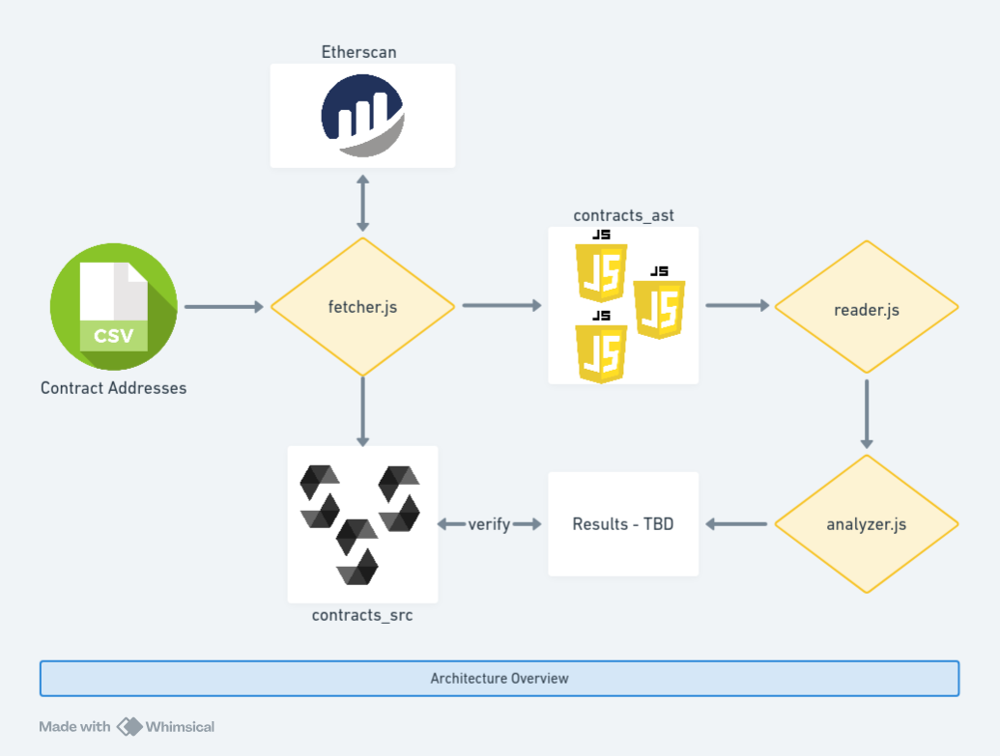

# Verified Solidity Contracts Sourcecode and Bytecode Analyzer

Also fetches the contract source code, makes AST from the fetched source code, and fetches the bytecode.

All the fetched files are in the form of _contract name_\__contract address_.



Code to fetch contracts from Etherscan based on their address and count the loops, as well as nested loop levels, in the fetched contracts.

Currently addresses can only be read from the CSV file you can find [here](https://etherscan.io/exportData?type=open-source-contract-codes).

## Requirements

- NodeJS

## Setup

Run:

```sh
npm install
```

Download [the CSV](https://etherscan.io/exportData?type=open-source-contract-codes) and save it as `contracts.csv` in the root of directory.

Make sure you have a valid Etherscan API key and you save it to the `.env` file as `ETHERSCAN_API_KEY`.

## Usage

Automated:

```sh
chmod +x run.sh && ./run.sh
```

There are two fetching scripts that make 4 API calls per second. And in `contracts.csv` there are 5000 contracts.

After all the fetching is done, three directories should appear:

- contracts_ast
- contracts_src
- contracts_bytecode

You can use these to verify the results. Especially the source code.

After the contacts have been fetched you can just run:

```sh
node index.js
```

This will read the contract ASTs from `contracts_ast` and count the loops, along with reading `contracts_bytecode` and count the `SSTORE` opcodes.

## Statistics

- Max loop depth (along with source file name to confirm)
- Max nesting histogram of each file with generated AST (4552 in total)
- Max `SSTORE` count (along with bytecode file name)
- Average `SSTORE` count (of 5000 in total)
- `SSTORE` histogram
